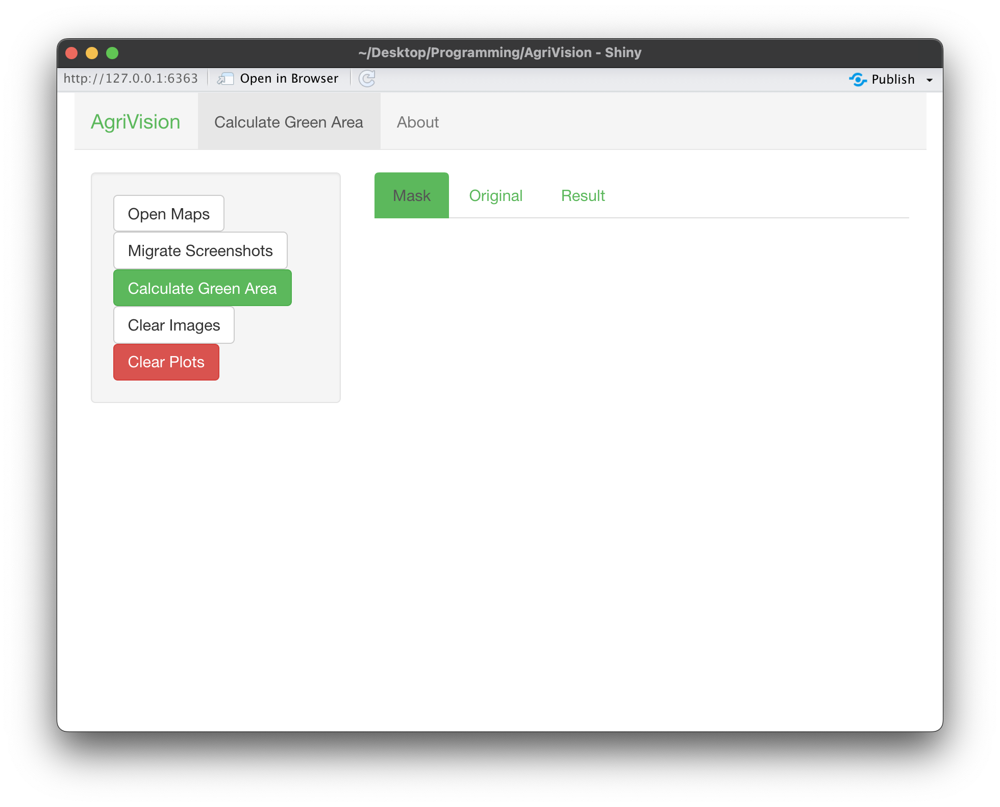
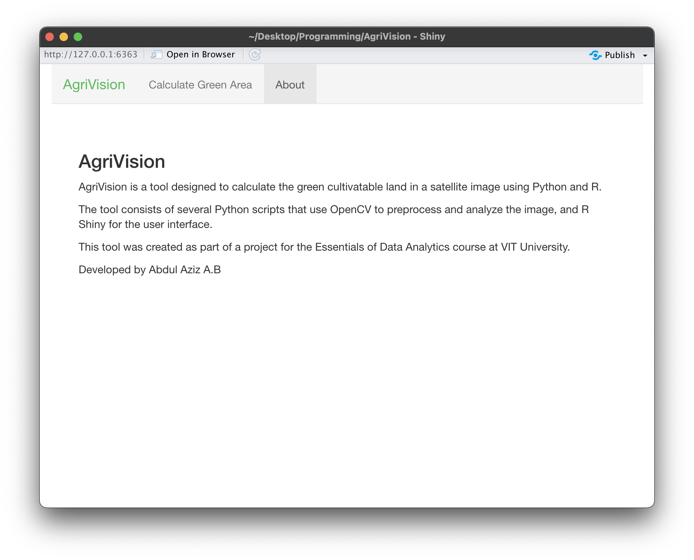
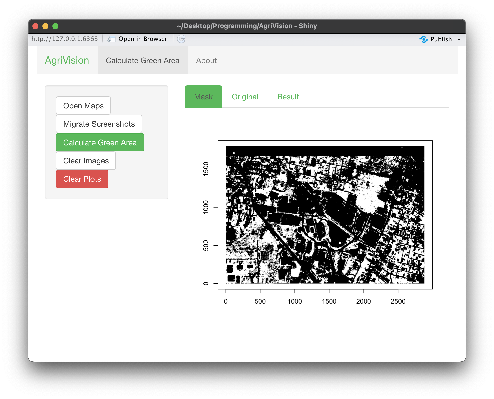
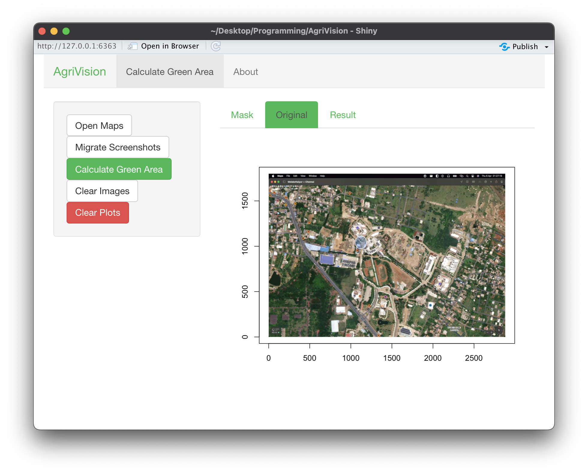
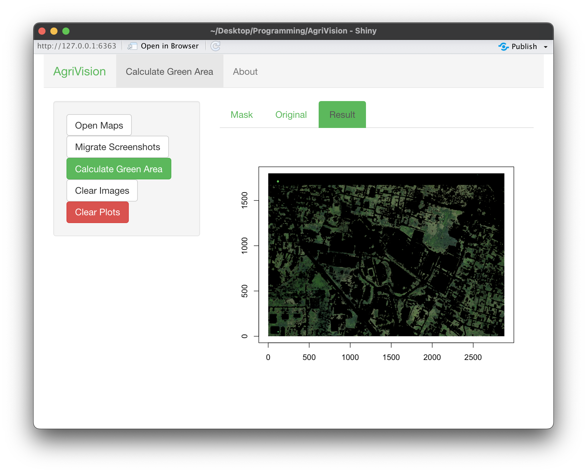
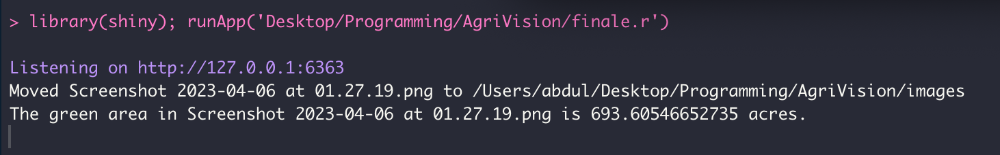

# AgriVision: A way to find cultivatable lands using satellite imagery.

AgriVision is a project aimed at finding cultivatable land for agricultural needs using computer technology and image processing techniques. The lack of suitable land for food crops cultivation is a significant challenge in improving the farming sector. With increasing population and demand for food, this project serves as a starting point for further research and development in the field of agriculture and food production.

## Features

- Utilizes real-time satellite images and advanced image processing techniques to identify cultivatable land
- Provides a user-friendly interface through R Shiny app
- Marks regions with greener areas as potential cultivatable land

This is the interface that the user sees when they run the app.R file. The user can upload the satellite image of the land to be processed and view the results.

This is the about page of the app. It provides a brief description of the project and the team members.

This is the user controlled that opens up when the user presses "Open Map". The user can zoom in and out of the map and click a snapshot of the map to save it and find the cultibatable lands in acres, we need to zoom it in up to 126 yds and then click the snapshot as the function for calculating the area is put to a map scale of 126yds per cm.

  
  

This shows the green areas segregated visually as a plot within the app interface.

This shows the output of the image, where the area is printed in acres, it also shows the output of the migrate button which is used to migrate the screenshots saved in a default folder onto the folder where the project is contained for the program to read it. 

## Getting Started
To get started with AgriVision, follow these steps:

1. Clone the repository
2. Install the necessary dependencies
3. Run the app.R file
4. Upload the satellite image of the land to be processed
5. View the processed images and the mapped cultivatable land

## Usage
AgriVision can be used to identify and map cultivatable land for agricultural needs. The results obtained from the image processing techniques can help farmers and agricultural organizations make informed decisions and contribute to the growth and development of the agriculture sector.

## Conclusion
AgriVision is a step forward in meeting the increasing demand for food. By bridging the gap between modern technology and agriculture, this project paves the way for a sustainable and self-sufficient future. "Empowering agriculture with technology for a sustainable future.”

